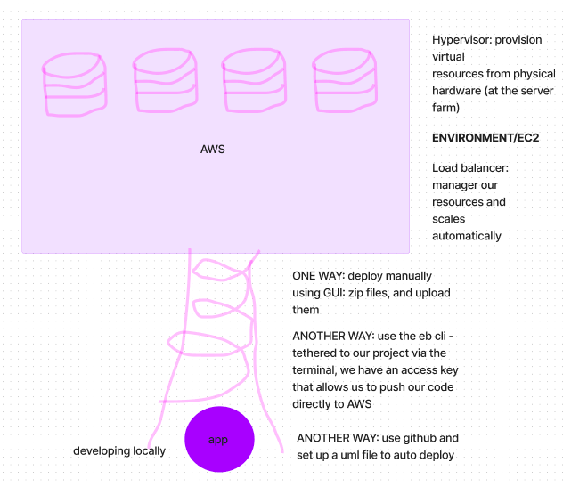

# cloud-server

## GUI Deployment

[Deployed Link](http://cloudserver-env.eba-jxqm3pn3.us-west-2.elasticbeanstalk.com/)

### Process

1. Zip the repo besides package.json.lock and by
2. Create AWS account
3. Set up IAM
4. Choose free plan
5. Navigate to Elastic Beanstalk
6. Click "Create application"
7. Name the application
8. Use Node.js as the platform
9. Upload zipped repo file

## CLI Deployment Process

[Deployed Link](https://cloud-server-dev2.us-west-1.elasticbeanstalk.com/)

### Process

Command to run

- aws configure
  - Copy and paste the access ID and Access Key from your AWS account to the Access ID and Access Key lines in the terminal
  - Select default region (us-west-2)
  - Select all default outputs

- Check eb — version
- eb init
  - Use default application name cloud-server
  - Select number 1, the free option
  - Dont set up or enable anything extra

Run:

- eb create
  - Go with suggestions and defaults
  - Dont enable anything extra

After create, rn eb deploy to redeploy when changes are made

### Credits and Collaborations
- [401d49 Demo Code](https://github.com/codefellows/seattle-code-javascript-401d49/tree/main/class-16/live-demo/simple-server)
